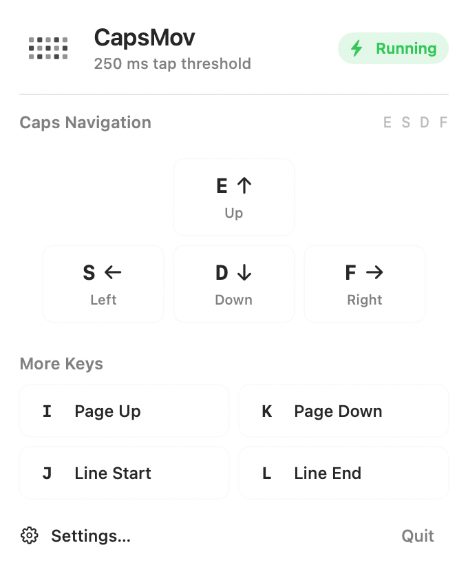
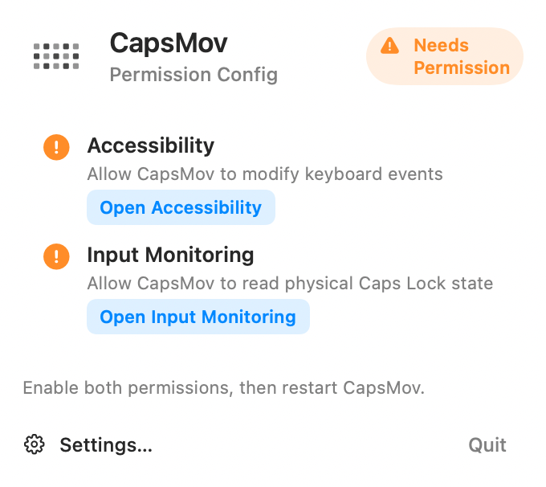
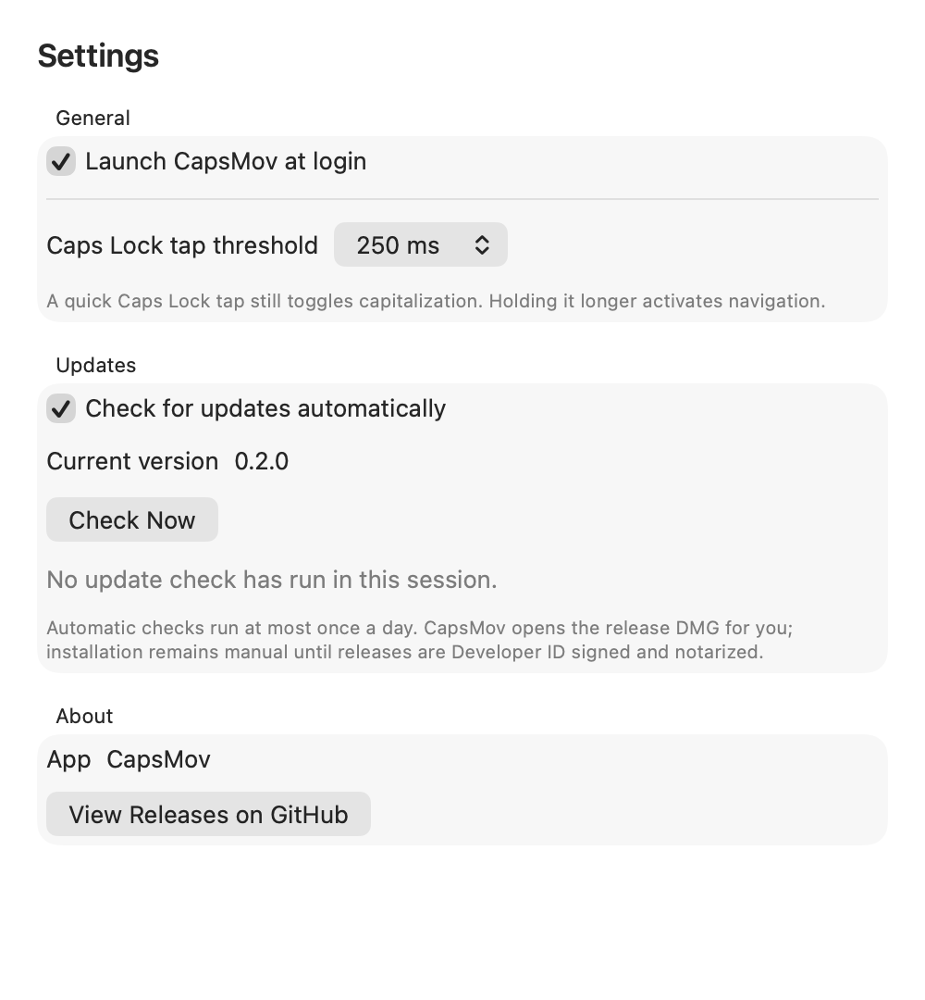

# CapsMov

[](https://github.com/Chivier/CapsMov/actions/workflows/ci.yml)
[](https://github.com/Chivier/CapsMov/releases/latest)

CapsMov is a lightweight native macOS menu-bar app that turns Caps Lock into a temporary navigation layer. It uses macOS system frameworks directly and does not require Karabiner-Elements.

## Download and install

CapsMov requires macOS 13 or later. Release builds are universal and support Apple Silicon and Intel Macs.

1. Download the latest `CapsMov-*-macOS.dmg` from [GitHub Releases](https://github.com/Chivier/CapsMov/releases/latest).
2. Open the DMG and drag `CapsMov.app` into `Applications`.
3. Open CapsMov. If macOS says the developer cannot be verified, right-click the app, choose **Open**, and confirm once.
4. Grant CapsMov both **Accessibility** and **Input Monitoring** access when prompted.
5. Open **Settings…** from the menu-bar popover if you want CapsMov to launch at login.

Releases are currently ad-hoc signed rather than Developer ID signed and notarized. Update downloads and installation therefore remain user-confirmed.

## Shortcuts

Hold Caps Lock and press:

| Shortcut | Result |
| --- | --- |
| `Caps + E` | Up |
| `Caps + D` | Down |
| `Caps + S` | Left |
| `Caps + F` | Right |
| `Caps + I` | Page Up |
| `Caps + K` | Page Down |
| `Caps + J` | Line Start (`Command + Left`) |
| `Caps + L` | Line End (`Command + Right`) |

A quick standalone Caps Lock tap keeps the normal capitalization toggle. Holding Caps Lock longer, or pressing another key while it is held, uses it as the navigation modifier instead.

## Menu-bar app

The popover keeps the daily workflow compact:

- current running, paused, permission, and Secure Input status;
- a single switch for the navigation layer;
- the shortcut map;
- direct links to the required macOS privacy panes;
- recovery guidance when Secure Input blocks keyboard monitoring;
- access to Settings and Quit.



First-run permission guidance:



## Settings and updates

Settings contains the options that should not crowd the status popover:

- **Launch CapsMov at login**
- **Caps Lock tap threshold** from 150 to 500 ms
- **Check for updates automatically**
- current version and an on-demand **Check Now** action
- a direct download action when a newer GitHub Release is available



Automatic checks run at most once per day and only request the public GitHub Releases API. CapsMov does not send usage or keyboard data. When an update is available, it opens the release DMG; replacing the app remains manual until releases are Developer ID signed and notarized.

## Permissions and recovery

CapsMov needs two macOS permissions:

- **Accessibility** lets it rewrite keyboard events.
- **Input Monitoring** lets it read the physical Caps Lock state.

Open the corresponding panes from the popover, or go to **System Settings → Privacy & Security**.

Secure Input fields and some system security contexts temporarily block event taps. CapsMov resumes automatically after the password field loses focus. If macOS leaves Secure Input attached to a process that has already exited, the popover offers a safe reset action: it locks the screen once and rechecks after you unlock, without quitting your apps or documents.

The login window is outside the scope of this user-session app. Keyboards that do not emit normal macOS keyboard events cannot be remapped by this implementation.

## Build from source

The project uses Swift Package Manager and macOS system frameworks only.

```sh
swift test
swift build
swift run capslox
```

Build the app bundle or DMG:

```sh
scripts/build-app.sh
scripts/build-dmg.sh
```

Generated artifacts are written under `dist/` and are intentionally ignored by Git.

For a full local release verification and versioned artifact:

```sh
scripts/release.sh
```

This runs the Swift tests, packaging smoke tests, DMG validation, and SHA-256 generation.

## Release process

The current version is stored in `VERSION` and mirrored by `CapsMovRelease.currentVersion` for development builds. The release script rejects version drift.

To publish a release:

1. update both version values;
2. run `scripts/release.sh`;
3. commit and push the verified changes;
4. tag the commit as `v<version>` and push the tag.

The [Release workflow](.github/workflows/release.yml) rebuilds and tests the app on macOS, creates the GitHub Release, and uploads the versioned DMG plus its SHA-256 checksum. The [CI workflow](.github/workflows/ci.yml) runs tests and packaging checks for main and pull requests.

## Architecture

- `CapsloxCore` contains the tested remapping state machine, presentation data, Secure Input parsing, version comparison, and GitHub Release models.
- `capslox` owns the HID monitor, event tap, menu-bar UI, settings window, login-launch integration, and update checks.
- Generated events are marked and ignored by the event tap to prevent recursion.
- IOHID tracks the physical Caps Lock state across built-in, USB, and Bluetooth keyboards.

`Caps + J/L` emits `Command + Left/Right`, which behaves consistently as line navigation in standard macOS text fields.
